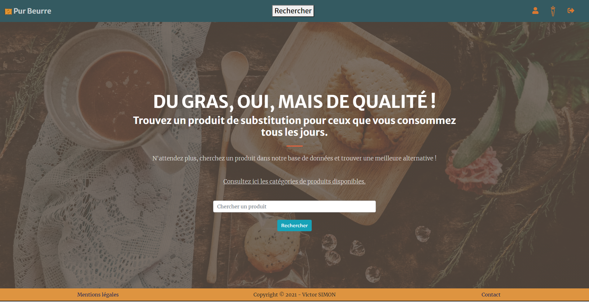

# **Pur Beurre, the website allowing you to look for healthier food!**
 
## What is the objective of this website?
In this website the goal is to allow the user to find healthier products than the ones he already consumes.

## How does it work?

The application behind the website uses data collected on the OpenFoodFacts platform, using its API. 
All the collected data is saved in a database dedicated to this application.
The user needs to connect in order to look for a product.
Once connected, the user can search for a product on the main page:


In order to find the wanted product, the terms of the request need a certain accuracy, using gthe name of the product and/or its brand.
Only some categories of product are available, they can be found in the 'settings.json' located in the folder application/main/management/commands.

Once the product found, the application will propose a maximum of 6 alternative products with a better or same nutriscore.
The user can click on "Sauvegarder" under each of them and a bookmark will be saved.


Each bookmark represents the searched product replaced by the chosen alternative product. The bookmarks can be consulted in the special interface by clicking on the carrot icon on the top right in the navigation bar.


The bookmarks can be deleted by clicking "supprimer" on their right part.


# **How to install the app?**

You will need Django in order to use this applicationt will come automatically when extracting the requirements.

Fork the repo or download the files and install the dependencies with:  
On Windows:
```bash
> pip install -r requirements.txt
```
On Linux:
```bash
> pip3 install -r requirements.txt
```

## Django settings

Django is a complete framework offering various options, tools and services. Checking its [official documentation](https://docs.djangoproject.com/en/3.1/) is the best way to learn using it.

Once the files of the application copied on yours, you will need to open the application/pur_beurre/settings.py file.

You can see in the 'INSTALLED_APPS' parameters all the applications installed (obviously), including the created ones: main, bookmark, authentication.

The following settings are made in order to match with the organization and architecture of this application. If you wish to modify the apps or other settings, be sure to check the Django documentation, in which you can directly look for the settings you wish to modify.

For example, the parameter 'AUTH_USER_MODEL = "authentication.User" ' is used to replace the built-in User model of Django by the custom one built in the authentication app.
Check the [custom user documentation](https://docs.djangoproject.com/en/3.1/topics/auth/customizing/#auth-custom-user) for more infos.

In line 87 you can find the "DATABASES" setting, which contains various elements.
The django documentation gives you the engine parameter you will need to put depending on the database system.
The name, user and its password are parameters you define in your own database system.

Another setting you might want to modify is "TIME ZONE = 'Europe/Paris' " located at line 123, in case it doesn't match with your time zone.

## The database

**I chose PostgreSQL for this project but Django can work with other systems, although deploying the project on Heroku is only possible when using PostgreSQL.**

Once you have defined the name of your database, the user and its password, you can start feeding the database.

First of all be sure to apply the migrations of the models into your database using the appropriate command:
```bash
> py manage.py makemigrations
```
On Linux:
```bash
> python manage.py makemigrations
```
You should see a '0001_initial.py' file created in the 'migrations' folders of each application.

You can then confirm the migrations and apply them to the database by using the following:
```bash
> py manage.py migrate
```
On Linux:
```bash
> python manage.py migrate
```
For more informations, once again, refer to the [Django documentation](https://docs.djangoproject.com/en/3.1/topics/migrations/).

Once the migrations effective the tables have been created in your database.
You will need to use 2 different files located in the folder application/main/management/commands to feed them.

The first file is 'db_create_categories.py', it will create the categories located in the 'settings.py' (that can also be found in the folder application/main/management/commands) into the 'category' table of your database.
```bash
> py manage.py db_create_categories
```
On Linux:
```bash
> python manage.py db_create_categories
```


If you wish to modify the categories fed into the table, modify them in the 'settings.py' file. Take note that they are divided like follow:
```json
 "Main category 1": ["Sub category 1",
                     "Sub category 2",
                     ...],
 "Main category 2": ["Sub category 1",
                     "Sub category 2",
                     ...],
 ...
```

Each main category will not be used to extract products or data from the Openfoodfacts database, only the sub categories will be used for this purpose.
But ordering them this way allows us to settle each product to be referenced in two categories, its sub category and its main category. That way, when the program will look for alternative healthier products, it can search in the sub and main category of the target product.

**If you wish to delete a category from your database (and therefore all the products attached to it), you can use the script 'db_delete_category.py'.**
**Example to delete the category soda:**
```bash
> py manage.py db_delete_category soda
```
On Linux:
```bash
> python manage.py db_delete_category soda
```
(if the category has two words in its name, you can indicate it like this 'category name')
**Only after you can manually delete it from the 'settings.py'.**
**If the deleted category is a Main category be sure to delete all its sub categories.**
**If the deleted category is a Sub category be sure to delete only this one, and not any other sub of the same group.**

